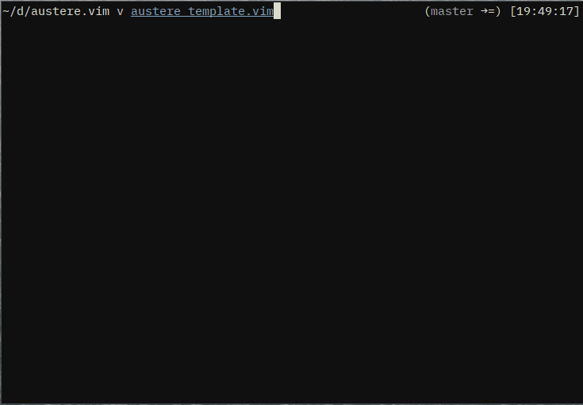

# Austere.vim

_Severe or stern in disposition or appearance; somber and grave_

This colorscheme was done using [vim-colortemplate](https://github.com/lifepillar/vim-colortemplate).

To update it, change the `austere_template.vim` file, and run `:Colortemplate .` (you ned the plugin for this to work).

### How to install

#### Vundle

    Plugin 'lurst/austere.vim'

#### NeoBundle

    NeoBundle 'lurst/austere.vim'

#### VimPlug

    Plug 'lurst/austere.vim'

#### Pathogen

    cd ~/.vim/bundle
    git clone https://github.com/lurst/austere.vim

Enjoy!
